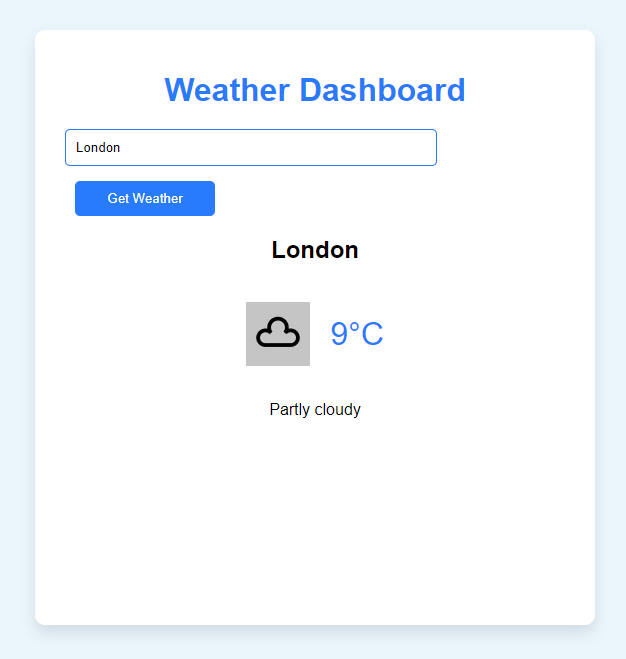

# Weather Dashboard

A simple and visually appealing weather dashboard that fetches real-time weather data for a given city using the WeatherStack API.

## Features

- Enter a city name to get its current weather details.
- Displays temperature, weather description, and a relevant weather icon.
- Visual representation of temperature trends (future feature).
- Interactive and modern design with a blue color scheme.

## Setup

1. **Clone/Download the Repository**: Get all the necessary files - HTML, CSS, and JavaScript.
2. **Open in a Local Environment**: Due to browser security policies regarding making HTTP requests (as the free tier of WeatherStack doesn't support HTTPS), it's recommended to use a local server to run this dashboard. Tools like [Live Server](https://marketplace.visualstudio.com/items?itemName=ritwickdey.LiveServer) for Visual Studio Code can be used.
3. **Enter a City**: Type in a city name and click the "Get Weather" button.

## Note

The dashboard does not work when accessed via HTTPS due to the WeatherStack free tier's restriction. Always use a live server or a local environment for accurate functionality.

## Future Enhancements

- Integration of visual graphs to show temperature trends.
- Additional details like humidity, wind speed, etc.

## License

This project is open source and available to everyone. Kindly provide attribution if you use it in your own projects.
